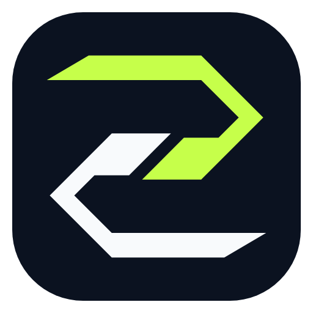
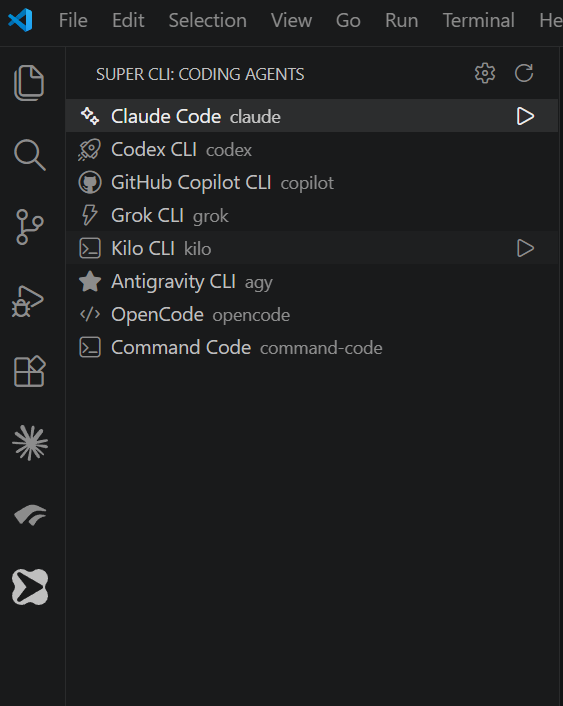
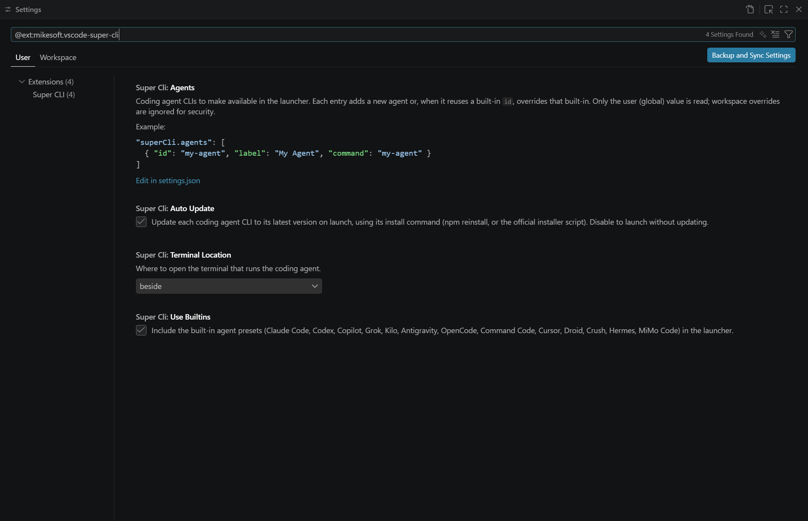

# Super CLI — AI Coding Agent CLI Launcher for VS Code

[Visual Studio Marketplace](https://marketplace.visualstudio.com/items?itemName=mikesoft.vscode-super-cli)
· [Open VSX](https://open-vsx.org/extension/mikesoft/vscode-super-cli)
· [CI](https://github.com/TheStreamCode/super-cli/actions/workflows/ci.yml)
· [Sponsor](https://github.com/sponsors/TheStreamCode)

<p align="center">
  
</p>

<p align="center"><strong>One launcher. Every coding agent.</strong></p>

Launch **Claude Code, OpenAI Codex CLI, GitHub Copilot CLI, Google Antigravity, OpenCode, Kiro CLI,
OpenClaw CLI, Cursor Agent, and other AI coding agents** inside VS Code from one sidebar and the native
integrated terminal. Super CLI keeps every supported agent one click away without replacing its
official command-line experience.

It works on Windows, macOS, Linux, and WSL, and across the VS Code family: VS Code, Cursor,
Antigravity, and Windsurf. It is free, open source, and has no telemetry or automatic CLI installers.

## Install Super CLI in VS Code

[Install Super CLI from the Visual Studio Marketplace](https://marketplace.visualstudio.com/items?itemName=mikesoft.vscode-super-cli),
or run:

```bash
code --install-extension mikesoft.vscode-super-cli
```

You can also open the Extensions view in VS Code, Cursor, Antigravity, or Windsurf, search for
**Super CLI**, and select **Install**.

This extension is unofficial and is not affiliated with, endorsed by, or sponsored by Anthropic,
OpenAI, GitHub, Google, or any other vendor. See the [third-party
notices](TRADEMARKS.md).

## Interface

### Agent sidebar and editor launcher

The activity bar opens a status-aware list with vendor-specific agent icons. Ready agents stay at the
top; CLIs not found on the active `PATH` are grouped under **Setup required**. Agents are sorted
alphabetically within each status group. The colored Router S in the editor toolbar opens the same
launcher without leaving the current file.



### Focused configuration

All settings are available in one filtered view. Commands can be shared across platforms or
defined explicitly for Windows, macOS, and Linux; WSL deliberately selects the Linux command.



## Features

- **One launcher for every agent.** A **Super CLI** view in the activity bar lists all configured
  agents; click one to open it in a terminal beside your editor. A toolbar button and the
  **Super CLI: Launch Coding Agent** command open a quick pick of the same list.
- **Favorite agent, one keystroke.** Set or remove the favorite from either the sidebar or launcher,
  then launch it anywhere with **`Ctrl+Alt+A`** (`Cmd+Alt+A` on macOS; remap it in Keyboard
  Shortcuts). With no favorite set the shortcut opens the picker and offers to remember your choice.
- **Ready and setup states.** The sidebar groups ready agents, unknown WSL states, and CLIs that need
  setup. Agents are alphabetical within each section, while the launcher keeps the favorite in its
  own section.
- **Agent Manager.** Choose exactly which built-in CLIs appear from the sidebar toolbar or with
  **Super CLI: Manage Built-in Agents**. Hiding a favorite safely clears the favorite selection.
- **Agent Doctor.** Run an explicit, bounded local diagnostic to see detected CLI versions and
  missing or failing version checks. It does not perform network update checks and its report omits
  environment variables, `PATH` contents, launch commands, and raw diagnostic output. The report is
  a single read-only virtual document that is replaced on every run and is never written to disk.
- **Agent-specific artwork.** Built-ins use vendor-sourced CLI marks where suitable SVGs are
  available, with a documented compact fallback for Kimi and a ThemeIcon fallback for custom agents.
- **Built-in presets.** Claude Code, Codex, GitHub Copilot CLI, Cursor, Droid, Grok, Kilo, Kiro,
  OpenClaw, Antigravity, OpenCode, Command Code, Crush, Hermes, MiMo Code, Pi, and Kimi Code CLI are
  available out of the box.
- **Add your own, no code required.** Define new agents in `settings.json`. The sidebar updates
  automatically.
- **Update from the sidebar.** Agents with a known update command show an update button next to
  Launch, which runs the CLI's official update (e.g. `codex update`, `kilo upgrade`, `cursor-agent
  update`, `opencode upgrade`, `droid update`, `openclaw update`, `kimi upgrade`). CLIs that update themselves don't
  show one. With terminal shell integration available, Super CLI reports whether the update completed
  or failed and can bring the update terminal back into focus.
- **Official installation docs.** If a supported CLI isn't found, Super CLI opens that agent's verified
  official installation documentation in your browser. It never installs a CLI, runs an installer, or
  changes your shell profile.
- **Native integrated terminal.** Each agent runs in a real VS Code terminal, inheriting your
  shell, `PATH`, and environment. No bundled emulator, no runtime dependencies.

## Adding or overriding an agent

Add agents through the `superCli.agents` setting. Each entry creates a new agent, or — when it
reuses a built-in `id` — overrides that built-in (for example to point at a custom binary path).

```json
"superCli.agents": [
  {
    "id": "my-agent",
    "label": "My Agent",
    "command": "my-agent",
    "icon": "rocket"
  },
  {
    "id": "claude",
    "label": "Claude Code",
    "command": "\"C:\\Tools\\claude\\claude.exe\""
  },
  {
    "id": "adaptive-agent",
    "label": "Adaptive Agent",
    "command": {
      "windows": "adaptive-agent.exe",
      "macos": "adaptive-agent-macos",
      "linux": "adaptive-agent-linux"
    }
  }
]
```

- `id` — unique identifier; reuse a built-in id to override it.
- `label` — name shown in the sidebar and quick pick.
- `command` — the command that starts the CLI. Use one string when it is cross-platform, or an object
  with `windows`, `macos`, and `linux` strings for OS-specific commands. On Windows, quote executable
  paths that contain spaces.
- `icon` — optional [ThemeIcon](https://code.visualstudio.com/api/references/icons-in-labels) id,
  e.g. `sparkle` or `rocket`.
- `installationDocumentationUrl` — optional verified official installation documentation URL. When
  the command is missing, Super CLI offers to open this URL in your external browser; it does not run
  any installation command.
- `env` — optional environment variables set for the agent's terminal, e.g. to opt out of a CLI's
  IDE-extension auto-install via its own variable: `{ "CLAUDE_CODE_IDE_SKIP_AUTO_INSTALL": "1" }`.
- `updateCommand` — optional command to update the CLI. It accepts the same cross-platform string or
  `windows`/`macos`/`linux` object as `command`, and adds an update button next to the agent.
- `versionCommand` — optional command used only when you explicitly run Agent Doctor. It accepts the
  same cross-platform forms and should print a short version string without requiring authentication.

Every built-in preset defines its launch and update commands through the same platform-aware model.
When `superCli.useWsl` is enabled on Windows, Super CLI selects the `linux` command variant because
the command runs inside WSL.

Only the user (global) value of `superCli.agents` is used; workspace overrides are ignored so that
an untrusted repository cannot inject commands.

## Configuration

| Setting | Default | Description |
| --- | --- | --- |
| `superCli.agents` | `[]` | Your agents (added to or overriding the built-ins). |
| `superCli.useBuiltins` | `true` | Include the built-in agent presets. |
| `superCli.hiddenBuiltins` | `[]` | Built-in ids hidden by **Manage Built-in Agents**. Prefer the manager over editing this list. |
| `superCli.favoriteAgent` | `""` | Id of the agent launched by `Ctrl+Alt+A`. Set it with the ★ button in the sidebar rather than by hand. |
| `superCli.terminalLocation` | `beside` | Open the terminal `beside` the editor or in the `panel`. |
| `superCli.useWsl` | `false` | On Windows, open agents in WSL and use their Linux command variants. Ignored on macOS/Linux. |

Run **Super CLI: Open Settings** from the sidebar or the command palette to jump straight to these
settings.

## Troubleshooting

- **"… was not found."** The configured `command` was not found. Open the official documentation
  offered by Super CLI, or fix the command in settings. The launcher uses the active editor's
  workspace folder as the working directory.
- **Nothing happens on launch.** Make sure the workspace is trusted — the launcher is disabled in
  untrusted workspaces because it runs terminal commands.
- **"Setup required" looks wrong.** The indicator is a best-effort check of your `PATH` and doesn't
  spawn the CLI. WSL agents stay in the neutral **Agents** group because the Windows `PATH` doesn't
  reflect what's installed inside WSL. Use **Refresh Agents** after installing a CLI.
- **The wrong OS command runs.** Platform-specific custom commands must define all three keys:
  `windows`, `macos`, and `linux`. Super CLI selects the host OS automatically; WSL deliberately uses
  the `linux` variant because the command runs inside the WSL terminal.
- **A version is unavailable.** Run **Super CLI: Run Agent Doctor**. A custom agent needs a verified
  `versionCommand`; untrusted workspaces skip version commands, and each check is limited to five
  seconds and 4 KB of output.
- **Companion editor extensions.** Super CLI does not modify agent configuration files or shell
  profiles. It launches **Claude Code** with the official `CLAUDE_CODE_IDE_SKIP_AUTO_INSTALL=1`
  environment variable so its companion extension is not installed automatically.

## FAQ

### How do I launch Claude Code in VS Code?

Install Super CLI, open the **Super CLI** view in the activity bar, and select **Claude Code**. The
official `claude` CLI opens in a native integrated terminal beside your editor. You can also set it as
your favorite and launch it with `Ctrl+Alt+A` (`Cmd+Alt+A` on macOS).

### How do I run Codex CLI or GitHub Copilot CLI in VS Code?

Select **Codex CLI** or **GitHub Copilot CLI** from the Super CLI sidebar or run **Super CLI: Launch
Coding Agent** from the Command Palette. Super CLI starts the official `codex` or `copilot` command
in the current workspace.

### Can I use Google Antigravity, Kiro CLI, and OpenClaw CLI in VS Code?

Yes. Google Antigravity, Kiro CLI, and OpenClaw CLI are built-in presets. Super CLI detects their
commands, links to official setup documentation when available, and launches them with the correct
Windows, macOS, Linux, or WSL command variant.

### Which AI coding agents are supported?

Claude Code, Codex, GitHub Copilot CLI, Grok, Kilo, Kiro, OpenClaw, Antigravity, OpenCode, Command
Code, Cursor, Droid, Crush, Hermes, MiMo Code, Pi, and Kimi Code CLI out of the box — plus any CLI you
add in `settings.json`.

### Does Super CLI work on Windows, macOS, Linux, and WSL?

Yes. On Windows you can also launch agents inside WSL with `superCli.useWsl`.

### Is Super CLI free, and does it collect data?

Free and open-source (MIT), with no telemetry. It only runs the commands you configure, in your own
integrated terminal.

## Support

If Super CLI is useful to you, consider [sponsoring its development](https://github.com/sponsors/TheStreamCode).
Bug reports, feature requests, and contributions are welcome on
[GitHub](https://github.com/TheStreamCode/super-cli).

## Privacy

This extension does not collect telemetry, analytics, or personal data. It never installs CLIs or
modifies shell profiles; it only runs launch and user-requested update commands in your integrated
terminal, plus bounded version commands when you explicitly run Agent Doctor.

Keep credentials in each CLI's supported credential store or environment configuration rather than
embedding them directly in launch, update, or version command strings.

## Brand assets

The Router S combines the Super CLI initial with two directional command paths. The artwork is kept
flat and geometric so it remains legible from the 16 px editor toolbar through the 512 px Marketplace
listing.

| Usage | Asset |
| --- | --- |
| Marketplace and extension listing | [`media/icon.png`](media/icon.png), generated from [`media/icon.svg`](media/icon.svg) |
| Activity bar | [`media/sidebar-mark.svg`](media/sidebar-mark.svg), monochrome and theme-adaptive |
| Editor toolbar on light themes | [`media/toolbar-mark-light.svg`](media/toolbar-mark-light.svg) |
| Editor toolbar on dark themes | [`media/toolbar-mark-dark.svg`](media/toolbar-mark-dark.svg) |

## Building

```bash
npm ci
npm run check     # compile + unit tests + VS Code integration smoke test
npm run package   # produce the .vsix
```
