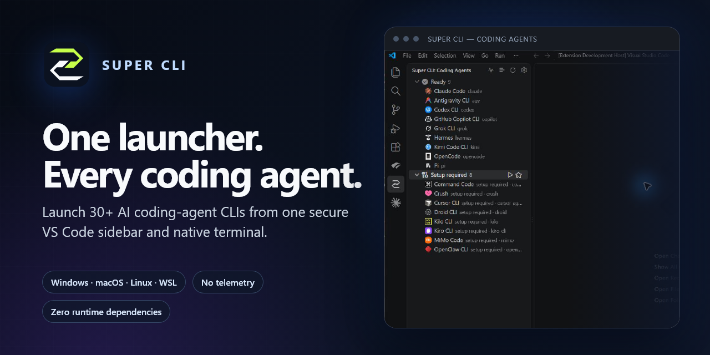
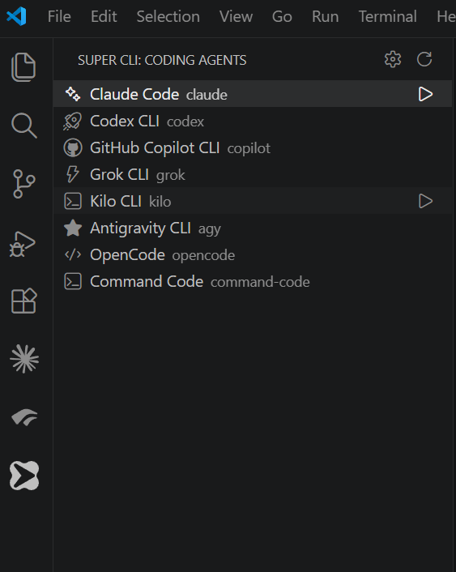

<p align="center">
  
</p>

<h1 align="center">Super CLI</h1>

<p align="center"><strong>One launcher. Every coding agent.</strong></p>

<p align="center">
  <a href="https://marketplace.visualstudio.com/items?itemName=mikesoft.vscode-super-cli"></a>
  <a href="https://open-vsx.org/extension/mikesoft/vscode-super-cli"></a>
  <a href="https://github.com/TheStreamCode/super-cli/actions/workflows/ci.yml"></a>
  <a href="LICENSE"></a>
</p>

Launch **Claude Code, OpenAI Codex CLI, GitHub Copilot CLI, Google Antigravity, OpenCode, Amp,
goose, Cline CLI, Mistral Vibe, Rovo Dev CLI, CodeArts Agent CLI, CodeBuddy Code CLI, and other AI
coding agents** inside VS Code from one
sidebar and the native integrated terminal. Super CLI keeps every supported agent one click away
without replacing its official command-line experience.

It works on Windows, macOS, Linux, and WSL, and on any editor that supports the VS Code extension
model — VS Code itself plus the forks that install from [Open VSX](https://open-vsx.org/extension/mikesoft/vscode-super-cli)
or from a `.vsix`, such as Cursor, Windsurf, Google Antigravity, Kiro, Trae, VSCodium, and Gitpod. It
is free, open source, and has no telemetry or automatic CLI installers.



## Requirements

- VS Code `1.93` or newer, or a compatible desktop editor that can install VS Code extensions.
- At least one supported coding-agent CLI installed and authenticated according to that vendor's
  documentation. Super CLI never installs or configures the CLI for you.
- A trusted workspace before launch, update, or version commands can run.

Node.js and npm are required only for developing or packaging Super CLI, not for installing the
extension or launching an agent.

## Install Super CLI in VS Code

[Install Super CLI from the Visual Studio Marketplace](https://marketplace.visualstudio.com/items?itemName=mikesoft.vscode-super-cli),
or run:

```bash
code --install-extension mikesoft.vscode-super-cli
```

You can also open the Extensions view, search for **Super CLI**, and select **Install**.

### Which editors it runs in

Super CLI needs an editor that runs VS Code extensions. That covers VS Code and its forks — Cursor,
Windsurf, Google Antigravity, Kiro, Trae, VSCodium, Gitpod and others. Because Microsoft's Marketplace
is licensed for Microsoft products only, forks generally install from
[Open VSX](https://open-vsx.org/extension/mikesoft/vscode-super-cli), or install a reviewed `.vsix`
from the matching [GitHub release](https://github.com/TheStreamCode/super-cli/releases) via
**Extensions: Install from VSIX…**.

The manifest requires VS Code `1.93` or newer — the actual floor of the terminal APIs used — rather
than the latest version, so forks that track upstream at a delay can still install it.

Editors with their own extension system cannot run it, and no configuration changes that: **Zed**
extensions are Rust crates compiled to WebAssembly, and **JetBrains** IDEs (IntelliJ, PyCharm,
WebStorm, …) use JVM plugins. Neither loads a `.vsix`. Note this is about the *editor*: agent CLIs like
Qoder CLI are supported as agents to launch, whichever supported editor you launch them from.

This extension is unofficial and is not affiliated with, endorsed by, or sponsored by Anthropic,
OpenAI, GitHub, Google, or any other vendor. See the [third-party
notices](TRADEMARKS.md).

## Quick start

1. Install and authenticate the coding-agent CLI you want to use.
2. Install Super CLI, open a folder, and trust the workspace after reviewing it.
3. Open **Super CLI** from the activity bar and select an agent, or run **Super CLI: Launch Coding
   Agent** from the Command Palette.
4. Optionally star one or more agents and use `Ctrl+Alt+A` (`Cmd+Alt+A` on macOS) for fast access.

The selected command runs in a native integrated terminal with the active workspace folder as its
working directory. Super CLI does not proxy the CLI or replace the agent's own authentication and
settings.

## Interface

### Agent sidebar and editor launcher

The activity bar opens a status-aware list with vendor-specific agent icons. A live **Running** group
leads the list the moment you launch an agent, followed by your own **Favorites** group, then **Ready**
agents; CLIs not found on the active `PATH` are grouped under **Setup required**. Agents are sorted
alphabetically within each group. The colored Router S in the editor toolbar opens the same launcher
without leaving the current file.



### Focused configuration

All settings are available in one filtered view. Commands can be shared across platforms or
defined explicitly for Windows, macOS, and Linux; WSL deliberately selects the Linux command. Open
the maintained settings surface with **Super CLI: Open Settings** rather than editing deprecated keys
by hand.

## Features

- **One launcher for every agent.** A **Super CLI** view in the activity bar lists all configured
  agents; click one to open it in a terminal beside your editor. A toolbar button and the
  **Super CLI: Launch Coding Agent** command open a quick pick of the same list.
- **Favorites, one keystroke.** Star as many agents as you like from either the sidebar or launcher;
  they lead the sidebar in their own **Favorites** group, matching the same launcher section. Launch
  with **`Ctrl+Alt+A`** (`Cmd+Alt+A` on macOS; remap it in Keyboard Shortcuts): with exactly one
  favorite it launches directly, with several it opens a quick pick scoped to just your favorites, and
  with none it opens the full picker and offers to remember your choice.
- **Ready and setup states.** The sidebar groups ready agents, unknown WSL states, and CLIs that need
  setup, each its own section below Favorites. Agents are alphabetical within each section.
- **Running sessions, live.** A **Running** group appears at the top of the sidebar the moment you
  launch an agent, showing every active session and how long it has been running. Click one to bring
  its terminal back into focus, use the inline restart button to stop and relaunch it in the exact
  same folder, the inline stop button to end it, or **Stop All** on the group header to end every
  running session at once. It clears itself as soon as the CLI exits (with terminal shell integration
  available) and always when the terminal closes. Super CLI never reads terminal content to show
  this — only the terminal's own lifecycle.
- **Survives a window reload.** Reloading the window (or installing an update) restarts the extension
  but not your agents: VS Code reconnects their terminals, and Super CLI picks them back up into the
  **Running** group instead of losing sight of them. Recovered sessions are marked *reconnected*,
  because their original start time is gone with the previous session and reporting a duration would
  be a guess.
- **Agent Manager.** Choose exactly which built-in CLIs appear from the sidebar toolbar or with
  **Super CLI: Manage Built-in Agents**. Hiding a favorited agent removes it only when that id is no
  longer available; a custom override with the same id remains favorited.
- **Agent Doctor.** Run an explicit, bounded local diagnostic to see detected CLI versions and
  missing or failing version checks. It does not perform network update checks and its report omits
  environment variables, `PATH` contents, launch commands, and raw diagnostic output. The report is
  a single read-only virtual document that is replaced on every run and is never written to disk.
- **Agent-specific artwork.** Every built-in has explicit light- and dark-theme SVG variants.
  Monochrome marks switch between black and white for contrast, while fixed-color marks preserve
  their vendor palette. Documented compact fallbacks cover Kimi and Codebuff; custom agents use a
  theme-aware ThemeIcon fallback.
- **Built-in presets.** Claude Code, Codex CLI, GitHub Copilot CLI, Grok CLI, Kilo CLI, Kiro CLI,
  OpenClaw CLI, Antigravity CLI, OpenCode, Command Code, Cursor CLI, Droid CLI, Crush, Devin CLI,
  Hermes, MiMo Code, Pi, Kimi Code CLI, Qoder CLI, Qwen Code CLI, Amp, OpenClaude, Oh My Pi, goose,
  Auggie CLI, Cline CLI, Codebuff, Continue CLI, Mistral Vibe, Rovo Dev CLI, CodeArts Agent CLI, and
  CodeBuddy Code CLI are available out of the box.
- **Add your own, no code required.** Define new agents in `settings.json`. The sidebar updates
  automatically.
- **Update from the sidebar.** Agents with a known update command show an update button next to
  Launch, which runs the CLI's official update (e.g. `codex update`, `amp update`, `goose update`,
  `cline update`, `omp update`, `vibe --check-upgrade`). CLIs that update themselves don't show one.
  With terminal shell integration available, Super CLI reports whether the update completed
  or failed and can bring the update terminal back into focus. **Super CLI: Update All Agents** in the
  sidebar toolbar runs every updatable agent's update in sequence, one at a time, in a single shared
  **Super CLI: updates** terminal, skipping any agent currently believed to be missing from `PATH`. It
  is cancellable at any point, and closing the terminal stops the run — so an update waiting on an
  interactive prompt can never strand the rest.
- **Official installation docs.** If a supported CLI isn't found, Super CLI opens that agent's verified
  official installation documentation in your browser. It never installs a CLI, runs an installer, or
  changes your shell profile.
- **Native integrated terminal.** Each agent runs in a real VS Code terminal, inheriting your
  shell, `PATH`, and environment. No bundled emulator, no runtime dependencies. The working directory
  follows the active editor's folder; in a multi-root workspace with no active editor, Super CLI asks
  which folder to use instead of guessing — declining the prompt falls back to the first folder.
- **One-time rating nudge.** After 20 successful launches, Super CLI shows a single notification
  asking for a Marketplace rating. It never repeats after that, however you respond, and the launch
  count lives only in this extension's local state — nothing is sent anywhere.

## Adding or overriding an agent

Add agents through the `superCli.agents` setting. Each entry creates a new agent, or — when it
reuses a built-in `id` — overrides that built-in (for example to point at a custom binary path).

```json
"superCli.agents": [
  {
    "id": "my-agent",
    "label": "My Agent",
    "command": "my-agent",
    "icon": "rocket"
  },
  {
    "id": "claude",
    "label": "Claude Code",
    "command": "\"C:\\Tools\\claude\\claude.exe\""
  },
  {
    "id": "adaptive-agent",
    "label": "Adaptive Agent",
    "command": {
      "windows": "adaptive-agent.exe",
      "macos": "adaptive-agent-macos",
      "linux": "adaptive-agent-linux"
    }
  }
]
```

- `id` — unique identifier; reuse a built-in id to override it.
- `label` — name shown in the sidebar and quick pick.
- `command` — the command that starts the CLI. Use one string when it is cross-platform, or an object
  with `windows`, `macos`, and `linux` strings for OS-specific commands. On Windows, quote executable
  paths that contain spaces.
- `icon` — optional [ThemeIcon](https://code.visualstudio.com/api/references/icons-in-labels) id,
  e.g. `sparkle` or `rocket`.
- `installationDocumentationUrl` — optional verified official HTTPS installation documentation URL.
  Credential-bearing URLs and non-HTTPS schemes are ignored. When the command is missing, Super CLI
  offers to open the URL in your external browser; it does not run any installation command.
- `env` — optional environment variables set for the agent's terminal, e.g. to opt out of a CLI's
  IDE-extension auto-install via its own variable: `{ "CLAUDE_CODE_IDE_SKIP_AUTO_INSTALL": "1" }`.
- `updateCommand` — optional command to update the CLI. It accepts the same cross-platform string or
  `windows`/`macos`/`linux` object as `command`, and adds an update button next to the agent.
- `versionCommand` — optional command used only when you explicitly run Agent Doctor. It accepts the
  same cross-platform forms and should print a short version string without requiring authentication.

Every built-in preset defines its launch and update commands through the same platform-aware model.
When `superCli.useWsl` is enabled on Windows, Super CLI selects the `linux` command variant because
the command runs inside WSL.

Only the user (global) value of `superCli.agents` is used; workspace overrides are ignored so that
an untrusted repository cannot inject commands.

### Environment variables and secrets

Super CLI itself requires no environment variables and does not load `.env` files. The optional
`env` object on a custom agent applies only to that agent's terminal; executable detection uses the
same overrides so a custom `PATH` is reflected in the sidebar status.

Keep credentials in the CLI vendor's supported credential store or in your normal shell environment.
Do not commit secrets in settings, command strings, or environment files. `.env` variants are ignored
by Git and explicitly excluded from VSIX packages as a defensive safeguard.

## Configuration

| Setting | Default | Description |
| --- | --- | --- |
| `superCli.agents` | `[]` | Your agents (added to or overriding the built-ins). |
| `superCli.useBuiltins` | `true` | Include the built-in agent presets. |
| `superCli.hiddenBuiltins` | `[]` | Built-in ids hidden by **Manage Built-in Agents**. Prefer the manager over editing this list. |
| `superCli.favoriteAgents` | `[]` | Ids of the agents launched by `Ctrl+Alt+A`. Set them with the ★ button in the sidebar rather than by hand. |
| `superCli.terminalLocation` | `beside` | Open the terminal `beside` the editor or in the `panel`. |
| `superCli.useWsl` | `false` | On Windows, open agents in WSL and use their Linux command variants. Ignored on macOS/Linux. |

Run **Super CLI: Open Settings** from the sidebar or the command palette to jump straight to these
settings.

## Troubleshooting

- **"… was not found."** The configured `command` was not found. Open the official documentation
  offered by Super CLI, or fix the command in settings. The launcher uses the active editor's
  workspace folder as the working directory.
- **Nothing happens on launch.** Make sure the workspace is trusted — the launcher is disabled in
  untrusted workspaces because it runs terminal commands.
- **"Setup required" looks wrong.** The indicator is a best-effort check of your `PATH` and doesn't
  spawn the CLI. WSL agents stay in the neutral **Agents** group because the Windows `PATH` doesn't
  reflect what's installed inside WSL. Use **Refresh Agents** after installing a CLI.
- **The wrong OS command runs.** Platform-specific custom commands must define all three keys:
  `windows`, `macos`, and `linux`. Super CLI selects the host OS automatically; WSL deliberately uses
  the `linux` variant because the command runs inside the WSL terminal.
- **A version is unavailable.** Run **Super CLI: Run Agent Doctor**. A custom agent needs a verified
  `versionCommand`; untrusted workspaces skip version commands, and each check is limited to five
  seconds and 4 KB of output.
- **Companion editor extensions.** Super CLI does not modify agent configuration files or shell
  profiles. It launches **Claude Code** with the official `CLAUDE_CODE_IDE_SKIP_AUTO_INSTALL=1`
  environment variable so its companion extension is not installed automatically.
- **I don't see a "Running" section.** It only appears once at least one agent has an active
  terminal session — launch an agent from the sidebar and it appears at the top instantly. It
  disappears once that terminal closes, or sooner when the CLI itself exits — the latter needs
  terminal shell integration, so without it (or on a shell that doesn't support it) the row stays
  until you close the terminal.
- **Super CLI asks which folder to launch in.** This only happens when it genuinely can't tell on its
  own — no active editor, and more than one folder open in a multi-root workspace. Press Escape to
  fall back to the first folder instead, same as every launch before this existed. Restarting a
  running session never asks — it reuses that session's original folder directly.
- **Update All Agents seems stuck on one agent.** An update command that waits for input (a
  confirmation prompt, a credential) can't complete on its own. Cancel the progress notification, or
  close the **Super CLI: updates** terminal — either one ends the run and reports how far it got.
  Cancelling stops Super CLI from starting further updates; a command already running in the terminal
  keeps going, so check that terminal before closing it.
- **I updated the extension but nothing changed.** Reload the window (**Developer: Reload Window**
  from the Command Palette) or restart your editor. Extension code loaded into a running window
  is not replaced until the window reloads, even after a newer version finishes installing.
- **A running agent didn't come back after a reload.** Recovery matches a surviving terminal to an
  agent by the terminal's name, so a renamed terminal can't be matched. It also relies on VS Code's own
  terminal persistence: if `terminal.integrated.enablePersistentSessions` is off, the terminals
  themselves don't survive a reload and there is nothing left to recover.
- **Sessions in another window aren't listed.** Each window sees only its own. VS Code gives an
  extension no access to another window's terminals, so a shared view across windows (or across two
  different editors) isn't something Super CLI can do today.

## FAQ

### How do I launch Claude Code in VS Code?

Install Super CLI, open the **Super CLI** view in the activity bar, and select **Claude Code**. The
official `claude` CLI opens in a native integrated terminal beside your editor. You can also set it as
your favorite and launch it with `Ctrl+Alt+A` (`Cmd+Alt+A` on macOS).

### How do I run Codex CLI or GitHub Copilot CLI in VS Code?

Select **Codex CLI** or **GitHub Copilot CLI** from the Super CLI sidebar or run **Super CLI: Launch
Coding Agent** from the Command Palette. Super CLI starts the official `codex` or `copilot` command
in the current workspace.

### Can I use Google Antigravity, Kiro CLI, and OpenClaw CLI in VS Code?

Yes. Google Antigravity, Kiro CLI, and OpenClaw CLI are built-in presets. Super CLI detects their
commands, links to official setup documentation when available, and launches them with the correct
Windows, macOS, Linux, or WSL command variant.

### Which AI coding agents are supported?

Claude Code, Codex, GitHub Copilot CLI, Grok, Kilo, Kiro, OpenClaw, Antigravity, OpenCode, Command
Code, Cursor, Devin CLI, Droid, Crush, Hermes, MiMo Code, Pi, Kimi Code CLI, Qoder CLI, Qwen Code CLI,
Amp, OpenClaude, Oh My Pi, goose, Auggie CLI, Cline CLI, Codebuff, Continue CLI, Mistral Vibe, Rovo
Dev CLI, CodeArts Agent CLI, and CodeBuddy Code CLI out of the box — plus any CLI you add in
`settings.json`.

### Does Super CLI work on Windows, macOS, Linux, and WSL?

Yes. On Windows you can also launch agents inside WSL with `superCli.useWsl`.

### Is Super CLI free, and does it collect data?

Free and open-source (MIT), with no telemetry. It only runs the commands you configure, in your own
integrated terminal.

## Support

If Super CLI is useful to you, consider [sponsoring its development](https://github.com/sponsors/TheStreamCode).
Bug reports, feature requests, and contributions are welcome on
[GitHub](https://github.com/TheStreamCode/super-cli).
Report suspected vulnerabilities privately according to [SECURITY.md](SECURITY.md), not in a public
issue.

## Privacy

This extension does not collect telemetry, analytics, or personal data. It never installs CLIs or
modifies shell profiles; it only runs launch and user-requested update commands in your integrated
terminal, plus bounded version commands when you explicitly run Agent Doctor. The only state it
keeps locally is your configuration (favorites, hidden built-ins) and a launch counter used solely to
show the one-time rating nudge described above — neither is ever transmitted anywhere.

Keep credentials in each CLI's supported credential store or environment configuration rather than
embedding them directly in launch, update, or version command strings.

## Development

Development requires Node.js 22, npm, and VS Code 1.93 or newer. The repository includes `.nvmrc` for
Node version managers. Install the exact locked dependency tree before working:

```bash
npm ci
```

Press `F5` in VS Code to compile and open an Extension Development Host, or use these scripts:

| Command | Purpose |
| --- | --- |
| `npm run compile` | Compile strict TypeScript from `src/` to `out/`. |
| `npm run typecheck` | Run strict TypeScript checks without emitting files. |
| `npm run watch` | Recompile TypeScript while files change. |
| `npm run test:unit` | Compile and run the fast `node:test` unit suite. |
| `npm run test:integration` | Compile and launch the real VS Code Extension Development Host smoke test. |
| `npm run check` | Run compile, unit tests, integration tests, and the VSIX file-list dry run used by CI. |
| `npm run audit` | Check the complete dependency tree for moderate-or-higher known vulnerabilities. |
| `npm run package` | Compile, create an installable `.vsix`, and verify its embedded publisher, name, and version. |

There is no separate linter: `tsc --strict`, `noUnusedLocals`, and `noUnusedParameters` are the static
quality gate. Unit tests execute compiled files from `out/`, never TypeScript source directly. See
[CONTRIBUTING.md](CONTRIBUTING.md) for code, test, branding, and pull-request conventions.

## Build and distribution

Before producing a release artifact, run the same gates as CI and inspect the VSIX contents:

```bash
npm ci
npm run audit
npm run check
npm run package
```

For this project, deployment means publishing the reviewed VSIX rather than deploying a server. A
maintainer updates `package.json`, `package-lock.json`, `CHANGELOG.md`, and `CITATION.cff` together and
installs the generated VSIX in a clean Extension Development Host. Pushing the matching version tag
creates a GitHub release with a rebuilt, identity-verified VSIX and SHA-256 file. Marketplace and Open
VSX publication remain separate owner-controlled operations. Publishing credentials belong in the
platform's secret store or local credential manager and must never be committed.

On Windows, command-line install checks must use VS Code's `bin\code.cmd` wrapper; `Code.exe` is the
desktop application and does not provide the extension-management CLI even if PowerShell resolves it
first. The packaging command fails when the VSIX filename or either embedded manifest disagrees with
the source manifest, so a differently named extension cannot be sent to Super CLI's publishing path.

The complete maintainer checklist is in [CONTRIBUTING.md](CONTRIBUTING.md#release-checklist-maintainers).

## License

This project is licensed under the [MIT License](LICENSE).
